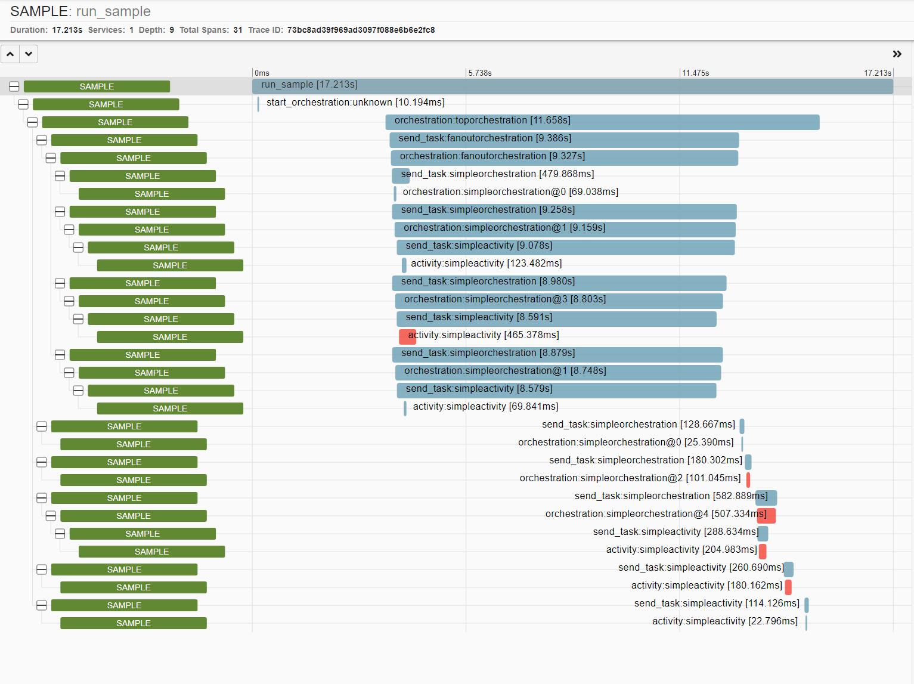

# Overview

This sample demonstrates OpenTelemetry compatibility for DurableTask via `Vio.DurableTask.Instrumentation`.

## Important Notes

1. Only distributed tracing is supported.
2. This relies on the current distributed tracing support in DurableTask.
3. Only AzureStorage is supported, as it is the only one which hooked into the current DurableTask DT system.

## Results

Running this sample will produce a ZipKin trace much like:

You can also view a JSON representation of the above [here](doc/zipkin-trace.json).
